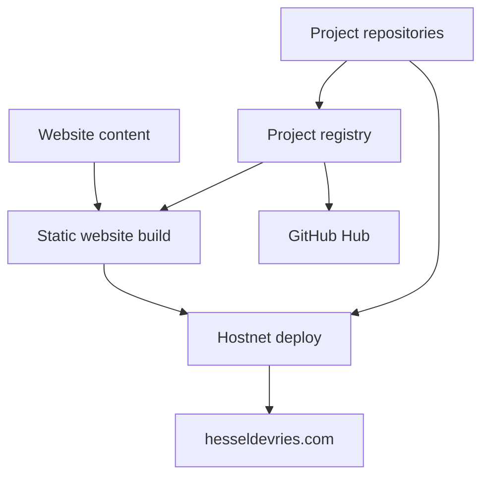

# Architectuur

Status: proposed  
Datum: 2026-10-02

## Ontwerpprincipes

| Principe | Betekenis |
|---|---|
| Eén bron | Iedere pagina, app en configuratie heeft precies één eigenaar |
| Registergestuurd | De Hub leest projectmetadata in plaats van uitzonderingen in code |
| Statisch waar mogelijk | Websites bouwen naar gewone HTML, CSS en JavaScript |
| Automatisch controleren | Test, build, security scan en healthcheck draaien vóór deploy |
| Centrale publicatie | Alleen `hostnet` bezit productiecredentials en publiceert |
| Minimale input | Een nieuw project vereist hoofdzakelijk één metadata-bestand |
| Herbruikbaar ontwerp | Kleuren, typografie, kaarten en CTA's komen uit één designsysteem |

## Systeemoverzicht



## Verantwoordelijkheden

| Repository | Verantwoordelijkheid | Mag niet |
|---|---|---|
| `github` | Projectregister, standaarden en Hub | Websitecode of productiecredentials bevatten |
| `website` | Homepage, projecten, diensten, blog en designsysteem | Andere apps handmatig kopiëren of zelf naar Hostnet deployen |
| `hostnet` | Eén centrale, veilige deploymentworkflow | Productcode bezitten |
| Apprepository | Code, tests, releases en metadata van één app | Zelfde app in een tweede repo onderhouden |

## Projectregister

De Hub verzamelt `turbo-project.json` uit projecten. De volgende versie van het schema bevat minimaal:

```json
{
  "schema_version": 1,
  "name": "RepCounter",
  "slug": "repcounter",
  "status": "active",
  "visibility": "public",
  "type": "web",
  "version": "0.1.0",
  "entrypoint": "index.html",
  "start_command": "npm run dev",
  "build_command": "npm run build",
  "artifact_path": "dist",
  "health_url": "",
  "public_url": "",
  "preview": "docs/previews/latest.webp",
  "tags": ["fitness", "web"],
  "owners": ["tommyvercettiseh"]
}
```

## Gewenste informatiestroom

1. Een projectwijziging komt in de eigen repository.
2. CI valideert metadata, tests en build.
3. De Hub leest status, versie, preview en release-informatie.
4. Alleen een expliciet publiceerbaar artifact gaat naar `hostnet`.
5. `hostnet` publiceert serieel, controleert hashes en voert live healthchecks uit.
6. De website toont projecten uit gestructureerde content, niet uit handmatig gekopieerde HTML.

## Migratievolgorde

| Fase | Resultaat |
|---|---|
| 1 | Rollen, projectregister en standaarden vastleggen |
| 2 | Lege, dubbele en oude repositories labelen of archiveren |
| 3 | Deployment terugbrengen naar alleen `hostnet` |
| 4 | Website opsplitsen in content, componenten, assets en buildoutput |
| 5 | Hub projectregister, builds en updates automatisch laten lezen |
| 6 | Reusable workflows en automatische kwaliteitscontrole uitrollen |

## Grenzen

Geen monorepo voor alle apps. De technologieën verschillen te veel en losse releases blijven nuttig. Centraliseer standaarden, metadata, designsysteem en deployment, niet alle broncode.
